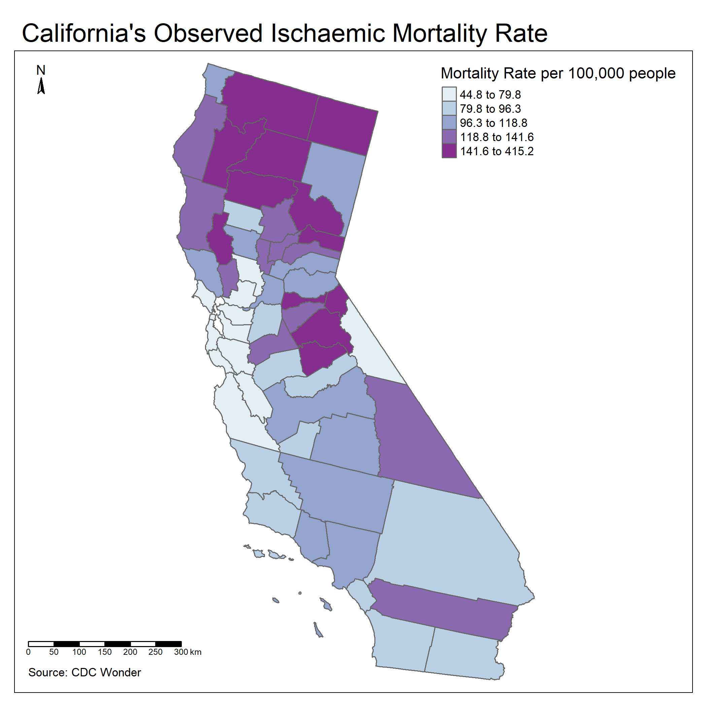
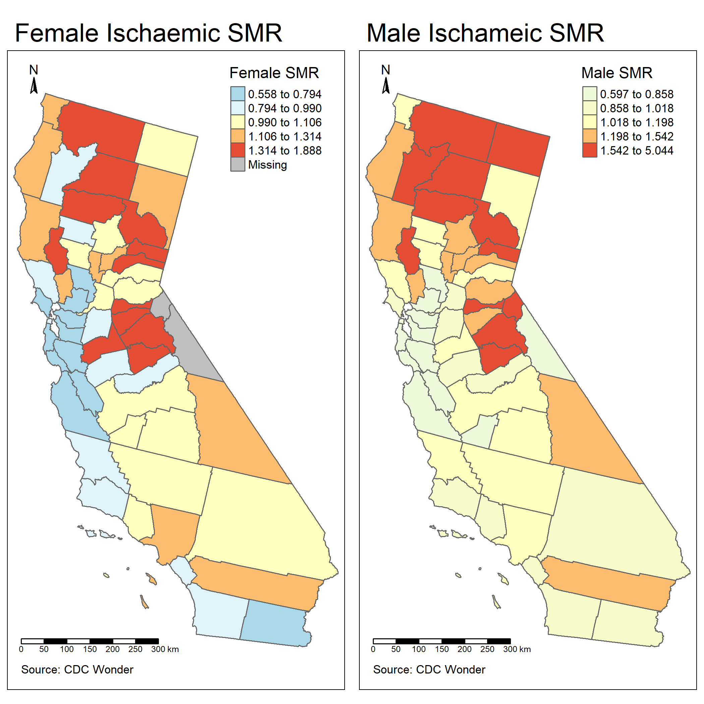

Final Report
================
Veronica Fay
04-25-2024

|     County      | Deaths | Population | Mortality Prevalence |
|:---------------:|:------:|:----------:|:--------------------:|
|  Alpine County  |   23   |    5540    |       415.1625       |
| Mariposa County |  189   |   86813    |       217.7093       |
|  Sierra County  |   28   |   14858    |       188.4507       |
|  Plumas County  |  165   |   93947    |       175.6309       |
|  Amador County  |  338   |   195227   |       173.1318       |
| Tuolumne County |  467   |   271584   |       171.9542       |
|  Shasta County  |  1545  |   898699   |       171.9152       |
|  Tehama County  |  526   |   320696   |       164.0183       |
|   Lake County   |  521   |   321609   |       161.9980       |
| Trinity County  |   94   |   62527    |       150.3351       |

Table 1: Top 10 Counties with Highest Observed Ischaemic Mortality
Prevalence

